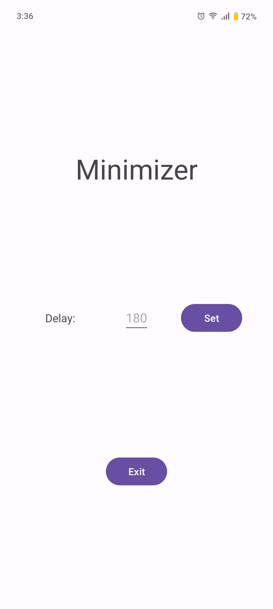

# capy

> Auto home-screen after inactivity — the chillest Android utility.

A lightweight Android app (Kotlin) that returns your device to the home screen after a configurable period of touch inactivity. Built for shared devices, kiosks, and controlled environments.



---

## Requirements

- Android 8.1+ (API 27)
- `SYSTEM_ALERT_WINDOW` permission (granted on first launch)

## Setup

```bash
cd src
./gradlew assembleDebug
```

APK output: `src/app/build/outputs/apk/debug/`

## Usage

1. Open the app — overlay permission prompt will appear if not yet granted
2. Enter a delay value between **15** and **3600** seconds (default: 60s)
3. Tap **Set** — the background service begins monitoring touch input
4. After the configured inactivity period, the device automatically returns home
5. Tap **Exit** to stop the service

## Project Structure

```
.config/        project-level configuration
.docs/          documentation & design notes
.github/        CI/CD workflows
.imgs/          screenshots & brand assets
.scripts/       build & deploy helpers
src/            Android source (Kotlin)
tst/            test reference
```

## Stack

- Kotlin 2.0.21
- Android SDK 36 (min API 27)
- AndroidX + Material3
- Kotlin Coroutines
- LifecycleService

---

Built by moshizmoshill
