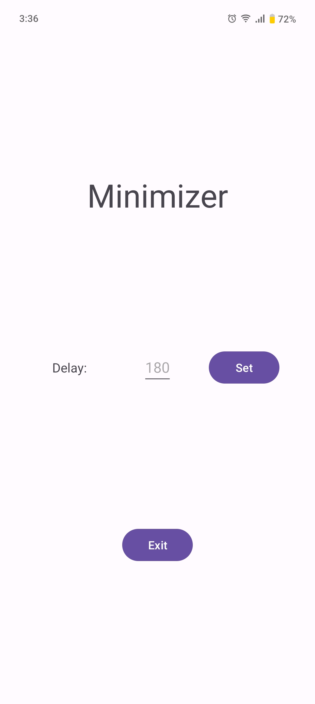

# capy — *homebody*

> Auto home-screen after inactivity — a personal utility for my handheld.

**homebody** (Android package `com.custom.minimizer`) is a lightweight Kotlin app that returns the device to the home screen after a configurable period of touch inactivity. This repo is tuned for one target: my personal handheld retro game system — **Gameboy Holo**, an Anbernic **RG557** running Android 14 — deployed to over wireless ADB (no cable).



---

## Features

- **Auto home-screen** — returns to the launcher after *N* seconds of no touch (15–3600s, default 60s).
- **Motion wake + app restore** — optional; wakes the device and restores the last foreground app on motion.
- **Battery alerts** — reports to the [pulsar](https://github.com/mvrph/pulsar) telemetry backend on the Olares server when the battery drops to/below a configurable threshold (default 20%) while unplugged, plus a baseline on every start.
- **OTA updates** — checks an update manifest on the Olares server, then downloads and installs newer signed builds. No Play Store.

## Requirements

- Android 8.1+ (API 27); built against SDK 36
- **JDK 17** to build — `brew install openjdk@17` (set `JAVA_HOME=/opt/homebrew/opt/openjdk@17`)
- Android SDK with platform-36 + build-tools (`local.properties` → `sdk.dir=...`)
- `SYSTEM_ALERT_WINDOW` (overlay) permission, granted on first launch

> On networks with broken/slow IPv6, Gradle is forced to IPv4 via `org.gradle.jvmargs` in `gradle.properties` so wrapper + dependency downloads don't time out.

## Build & deploy

Release builds are signed with the committed keystore (`src/app/capy-release.jks`, valid to 2053) so sideloaded installs **never expire**. `deploy.sh` defaults to a signed **release** build.

The device uses Android **Wireless debugging** (Android 11+): pairing is permanent, but the connect port rotates each session.

```bash
# 1. One-time pairing — Developer options > Wireless debugging > Pair device with pairing code
adb pair <device-ip>:<pairing-port> <6-digit-code>

# 2. Find the current connect port
adb mdns services | grep _adb-tls-connect

# 3. Build + install + launch (signed release; set BUILD_TYPE=debug for a debug build)
./.scripts/deploy.sh <device-ip> <connect-port>
```

A release-signed APK can't update a previously debug-signed install (different signature); `deploy.sh` auto-uninstalls and reinstalls in that case.

## OTA updates

The app checks `http://<olares>:8002/homebody/latest.json` on launch; if it advertises a higher `versionCode`, it downloads the APK and launches the installer (one tap). Publishing a new version:

```bash
# bump versionCode/versionName in src/app/build.gradle.kts, then:
(cd src && JAVA_HOME=/opt/homebrew/opt/openjdk@17 ./gradlew assembleRelease)
./.scripts/publish-ota.sh        # uploads the APK + writes latest.json on Olares
```

The OTA host is a `python3 -m http.server` systemd **user** service on Olares (`homebody-ota.service`, port 8002). On the handheld, Google Play Protect intercepts sideloads → choose **"More details → Install without scanning"**.

## Gamepad — Panda Gamepad Pro

The handheld maps its controls with **Panda Gamepad Pro** (`com.panda.gamepad`), which needs **Shizuku** (ADB shell-level privilege) to inject input. Shizuku's non-root server stops on reboot, which de-activates Panda.

```bash
./.scripts/reactivate-panda.sh [device-ip:port]   # drives Panda's activation UI over wireless adb
```

Activation **cannot** be done from inside homebody or via OTA — granting input-injection privilege is outside an app's sandbox. It only works via adb / Shizuku / root, and only while the device is awake and reachable on Wi-Fi. For activation that survives reboots you need **root** (Shizuku auto-starts) or Shizuku's on-device "Start via Wireless debugging".

## Scripts (`.scripts/`)

| Script | Purpose |
|--------|---------|
| `build.sh` | Build the debug APK. |
| `deploy.sh <ip> [port]` | Build (release by default) + install + launch over wireless adb. `BUILD_TYPE=debug` for debug. |
| `publish-ota.sh` | Upload the built release APK + write `latest.json` to the Olares OTA server. |
| `reactivate-panda.sh [ip:port]` | Re-activate Panda Gamepad Pro after a reboot, over wireless adb. |

## Backend

Battery alerts and OTA notifications ride on **pulsar** (FastAPI + SQLite telemetry backend) on the Olares server. The shared bearer token is embedded in `src/app/.../net/PulsarClient.kt` (committed — keep this repo private). Cleartext HTTP to the LAN/Tailnet host is whitelisted in `res/xml/network_security_config.xml`.

## Project structure

```
.config/        project-level configuration
.docs/          documentation & design notes
.github/        CI/CD workflows
.imgs/          screenshots & brand assets
.scripts/       build / deploy / OTA / gamepad helpers
src/            Android source (Kotlin)
tst/            test reference
```

## Stack

- Kotlin 2.0.21
- Android SDK 36 (min API 27)
- AndroidX + Material3
- LifecycleService + plain Threads / HttpURLConnection (no extra runtime deps)

---

Built by moshizmoshill
